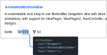
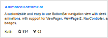

<h1 align="center">:zap: react-github-data</h1></br>
<p align="center">
  <!-- YS0 -->
  <br><br>
  A collection of GitHub components to easily display basic information about a GitHub user or repository.<br><br>
  This can, for example, be used to display the number of stars of a repository on your portfolio website, see <a href="https://joery.nl">Joery.nl</a> as an example.
</p>

<h6 align="center">
  &nbsp;&nbsp;
  &nbsp;&nbsp;By <a href="https://joery.nl">Joery Droppers</a>
</h6>

## Features
This library is not a widget; you can use the components to display a single piece of data and design your widget that suits your needs.
- Easy to use
- Data is fetched once for multiple components
- Fetched data is cached
- Easy to style and customize with CSS

## Installation
### NPM
```
npm install react-github-data
```

### Yarn
```
yarn add react-github-data
```

## Usage
### GitHubRepo

To display information about a repository use the `GitHubRepo` component.
```jsx
import { GitHubRepo } from 'react-github-data';
...
<GitHubRepo
  user="Droppers"
  repo="AnimatedBottomBar"
  type="stars" />
```

#### Required props
<table>
  <tr>
    <th>Property</th>
    <th>Description</th>
  </tr>
  <tr>
    <td>user</td>
    <td>The owners name (user or organization) of the repository.</td>
  </tr>
  <tr>
    <td>repo</td>
    <td>A repository name owned by the user set in the <b>user</b> prop.</td>
  </tr>
  <tr>
    <td>type</td>
    <td>The type of information about the repository to display, the following values are possible: 
        <pre>description
language
stars
watchers
forks</pre></td>
  </tr>
</table>

<hr>

### GitHubUser

```jsx
import { GitHubUser } from 'react-github-data';
...
<GitHubUser
  user="Droppers"
  type="followers" />
```

#### Required props
<table>
  <tr>
    <th>Property</th>
    <th>Description</th>
  </tr>
  <tr>
    <td>user</td>
    <td>The name of the user you want to display information of.</td>
  </tr>
  <tr>
    <td>type</td>
    <td>The type of information about the user to display, the following values are possible: 
        <pre>followers
following</pre></td>
  </tr>
</table>

## Customization
### Load and error callbacks
If you want to do something in case an error occurs while fetching the data or the data is successfully loaded, you can use one of the following callback props:
- onDataLoad
- onDataError

<i></i>

### Loading and error content

By default, the content of the component will be empty when loading or when an error occurs. To change the default content for these situations, you can use the props demonstrated in the example below.


```jsx
import { GitHubUser } from 'react-github-data';
...
<GitHubRepo
  loading={<div>Loading information. (JSX)</div>}
  error="Could not load information. (text)" />
```

### Styling
There are also several standard styleable classes that you can use, and you can use your own using the `className` prop. The inner HTML element of this component is a `span` element; this allows you to use the component inline with text.

<table>
  <tr>
    <th>classname</th>
    <th>Description</th>
  </tr>
  <tr>
    <td>github-<i>[user|repo]</i></td>
    <td>Postfix of this class depends on the component you use. This class is always present.</td>
  </tr>
  <tr>
    <td>github-loading</i></td>
    <td>This class will be present when the component is loading information from GitHub.</td>
  </tr>
  <tr>
    <td>github-loaded</i></td>
    <td>This class will be present when the component succesfully retrieved the information from GitHub.</td>
  </tr>
  <tr>
    <td>github-error</i></td>
    <td>This class will be present when the component failed to load information from GitHub.</td>
  </tr>
</table>

## Example


Below is an example of JSX and CSS on how to recreate the widget shown above.

<b>JSX</b>
```jsx
import React from 'react';
import { GitHubRepo } from 'react-github-data';

export default function App() {
  const user = "Droppers";
  const repo = "AnimatedBottomBar";

  return (
    <div className="github-card">
      <div className="name">AnimatedBottomBar</div>
      <div className="description">
        <GitHubRepo user={user} repo={repo} type="description" />
      </div>
      <div className="info">
        <GitHubRepo user={user} repo={repo} type="language" />
        
        <GitHubRepo user={user} repo={repo} type="stars" />
        
        <GitHubRepo user={user} repo={repo} type="forks" />
      </div>
    </div>
  );
}
```

<b>CSS</b>
```css
.github-card {
  width: 400px;
  padding: 15px;
  background-color: white;
  border: 1px solid #BBB;
  border-radius: 10px;
  font: 14px Arial;
}

.github-card .name {
  color: #0b69ff;
  font-weight: bold;
}

.github-card .description {
  margin: 10px 0;
}

.github-card .info span {
  margin-right: 10px;
}
.github-card .info img {
  margin-right: 5px;
  vertical-align: text-bottom;
}
```

## License
```
MIT License

Copyright (c) 2021 Joery Droppers (https://github.com/Droppers)

Permission is hereby granted, free of charge, to any person obtaining a copy
of this software and associated documentation files (the "Software"), to deal
in the Software without restriction, including without limitation the rights
to use, copy, modify, merge, publish, distribute, sublicense, and/or sell
copies of the Software, and to permit persons to whom the Software is
furnished to do so, subject to the following conditions:

The above copyright notice and this permission notice shall be included in all
copies or substantial portions of the Software.

THE SOFTWARE IS PROVIDED "AS IS", WITHOUT WARRANTY OF ANY KIND, EXPRESS OR
IMPLIED, INCLUDING BUT NOT LIMITED TO THE WARRANTIES OF MERCHANTABILITY,
FITNESS FOR A PARTICULAR PURPOSE AND NONINFRINGEMENT. IN NO EVENT SHALL THE
AUTHORS OR COPYRIGHT HOLDERS BE LIABLE FOR ANY CLAIM, DAMAGES OR OTHER
LIABILITY, WHETHER IN AN ACTION OF CONTRACT, TORT OR OTHERWISE, ARISING FROM,
OUT OF OR IN CONNECTION WITH THE SOFTWARE OR THE USE OR OTHER DEALINGS IN THE
SOFTWARE.
```
